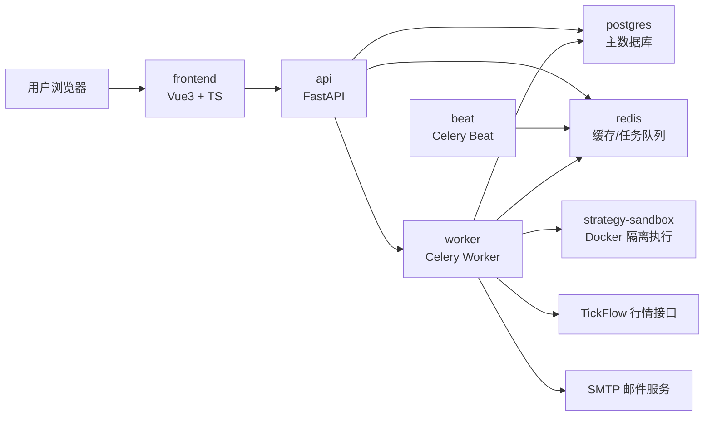

# 量化平台技术架构文档

## 1. 架构目标

本文档用于指导量化平台第一版从零实现。第一版定位为个人单用户、日线级、模拟盘量化平台，覆盖策略管理、历史回测、组合模拟监控、信号洞察、行情缓存管理和邮件提醒。

第一版固定技术栈如下：

- 前端：Vue 3、TypeScript、Element Plus、ECharts。
- 后端：Python、FastAPI、SQLAlchemy、Alembic。
- 回测引擎：Backtrader。
- 数据库：PostgreSQL。
- 缓存与任务队列：Redis。
- 异步任务：Celery Worker、Celery Beat。
- 部署：Docker Compose。
- 策略隔离：Docker 沙箱容器。
- 接口风格：REST API + FastAPI OpenAPI。

## 2. 总体架构

### 2.1 服务组成

系统由以下服务组成：

| 服务 | 职责 |
| --- | --- |
| `frontend` | Vue 前端应用，负责页面展示、表单交互、图表渲染和任务状态轮询。 |
| `api` | FastAPI 后端服务，提供 REST API、参数校验、权限边界、业务编排入口。 |
| `worker` | Celery Worker，执行策略测试、历史回测、组合监控、行情同步、图表预计算和邮件发送。 |
| `beat` | Celery Beat，负责定时触发交易日收盘后的组合监控任务。 |
| `postgres` | 主数据库，保存策略、行情、组合、交易、资金流水、指标、信号、通知和日志。 |
| `redis` | Celery broker/result backend，同时保存热点缓存、任务状态和短期图表缓存。 |
| `strategy-sandbox` | 策略隔离执行环境镜像，由 worker 调用 Docker 执行上传的 Python 策略。 |

### 2.2 服务关系



### 2.3 基本调用原则

- 前端只访问 `api`，不直接访问数据库、Redis 或行情接口。
- API 负责轻量请求、参数校验和任务提交，不直接执行耗时回测。
- 回测、行情同步、邮件发送、图表预计算等耗时操作全部由 Celery Worker 执行。
- Worker 执行用户上传策略时必须通过 Docker 沙箱，不允许在 API 或 Worker 进程内直接 `import` 用户策略代码。
- PostgreSQL 是事实数据源，Redis 只存缓存、任务状态和可重建数据。

## 3. 核心业务数据流

### 3.1 策略上传与测试

1. 前端提交策略名称、描述和 Python 代码，或上传 `.py` 文件。
2. API 保存策略基础信息和代码文件，计算代码哈希。
3. API 创建策略测试任务并返回 `task_id`。
4. Worker 拉取任务，调用 Docker 沙箱执行语法检查和最小化 Backtrader 测试。
5. 沙箱返回测试结果、错误堆栈和运行日志。
6. Worker 更新 `strategies` 的测试状态，并写入 `system_logs`。
7. 前端轮询任务状态并展示测试结果。

### 3.2 组合创建与历史回测

1. 用户选择一个策略、多个股票或 ETF 标的、起始日期、初始资金和交易参数。
2. API 创建 `portfolios`、`portfolio_instruments` 记录，状态置为 `initializing`。
3. API 提交组合初始化回测任务。
4. Worker 检查行情数据范围，缺失数据通过 TickFlow 获取并写入 `market_daily_bars`。
5. Worker 使用 Backtrader 执行从起始日期到最近交易日的日线回测。
6. 交易规则模块处理 T+1、100 股整数手、费用、滑点、停牌和涨跌停。
7. Worker 写入交易记录、资金流水、持仓快照、指标快照和图表缓存。
8. 组合状态更新为 `running` 或 `failed`。

### 3.3 定时监控与模拟成交

1. Celery Beat 在交易日收盘后触发组合监控任务。
2. Worker 查询所有 `running` 状态组合。
3. Worker 更新组合相关标的当日行情。
4. 策略基于最新日线数据生成买卖信号。
5. 信号写入 `signals`，并按邮件设置创建通知任务。
6. 次一交易日开盘价可用后，系统按信号生成模拟成交。
7. 成交后更新持仓、资金流水、交易记录、组合指标和图表缓存。
8. 成交通知写入 `notifications` 并发送邮件。

### 3.4 手动触发更新

1. 用户在组合详情页点击“手动更新”。
2. API 校验组合状态，提交一次组合监控任务。
3. 任务执行逻辑与定时监控一致。
4. 前端通过 `task_id` 轮询进度。

### 3.5 图表数据查询

1. 前端请求组合详情或信号洞察图表接口。
2. API 优先读取 `chart_snapshots` 中的预计算数据。
3. 如缓存缺失或过期，API 可返回当前已计算数据，并提交后台预计算任务。
4. 大时间范围图表按日期范围查询，避免一次返回过多数据。

### 3.6 邮件提醒

1. 信号、成交或错误事件产生后写入 `notifications`。
2. Worker 执行邮件发送任务。
3. 成功后更新发送状态和发送时间。
4. 失败时记录错误信息，按配置进行有限次数重试。

## 4. 后端架构

### 4.1 后端目录结构

```text
backend/
  app/
    main.py
    core/
      config.py
      database.py
      redis.py
      logging.py
      security.py
    api/
      router.py
      strategies.py
      portfolios.py
      market_data.py
      signals.py
      settings.py
      tasks.py
      logs.py
    models/
      strategy.py
      instrument.py
      market_data.py
      portfolio.py
      backtest.py
      trade.py
      metric.py
      signal.py
      notification.py
      log.py
      setting.py
    schemas/
      strategy.py
      instrument.py
      portfolio.py
      market_data.py
      signal.py
      notification.py
      task.py
      common.py
    repositories/
      strategy_repo.py
      instrument_repo.py
      market_data_repo.py
      portfolio_repo.py
      trade_repo.py
      metric_repo.py
      signal_repo.py
      notification_repo.py
      log_repo.py
    services/
      strategy_service.py
      portfolio_service.py
      market_data_service.py
      backtest_service.py
      monitoring_service.py
      notification_service.py
      chart_service.py
      settings_service.py
    engines/
      backtrader_engine.py
      trading_rules.py
      metrics_engine.py
      signal_insight_engine.py
      chart_builder.py
      sandbox_runner.py
    tasks/
      celery_app.py
      strategy_tasks.py
      backtest_tasks.py
      monitor_tasks.py
      market_data_tasks.py
      notification_tasks.py
      chart_tasks.py
    integrations/
      tickflow_client.py
      smtp_client.py
    utils/
      trading_calendar.py
      decimal.py
      time.py
      errors.py
  alembic/
  tests/
```

### 4.2 分层职责

| 层 | 职责 |
| --- | --- |
| API Router | REST 路由、请求参数校验、响应模型、任务提交入口。 |
| Schema | Pydantic 请求和响应模型。 |
| Service | 业务编排，例如创建组合、提交回测、生成图表、发送通知。 |
| Repository | SQLAlchemy 查询封装，不承载业务规则。 |
| Engine | 纯业务计算，包括 Backtrader 适配、交易规则、指标计算和信号洞察。 |
| Task | Celery 异步任务入口，负责事务边界、状态更新和失败处理。 |
| Integration | 第三方接口封装，例如 TickFlow 和 SMTP。 |

### 4.3 后端模块说明

#### 策略管理模块

- 保存策略元数据和代码文件路径。
- 校验策略文件扩展名、大小和编码。
- 创建策略测试任务。
- 查询策略测试状态和日志。
- 禁止 API 进程内直接执行用户代码。

#### 行情数据模块

- 统一封装行情读取逻辑。
- 查询时优先读取 PostgreSQL。
- 缺失数据调用 TickFlow 免费接口。
- 写入日线行情时按标的、交易日和复权类型去重。
- 第一版默认 `adjustment_type = none`。

#### 回测引擎模块

- 将数据库日线行情转换为 Backtrader data feed。
- 加载通过沙箱测试的策略。
- 执行从起始日期到结束日期的回测。
- 输出信号、交易、资金流水、持仓和净值序列。
- 不直接发送邮件，不直接处理 API 响应。

#### 交易规则模块

- 买入校验：可用资金、100 股整数手、涨停不可买、停牌不可买。
- 卖出校验：可卖数量、T+1、100 股整数手、跌停不可卖、停牌不可卖。
- 费用计算：佣金、印花税、滑点。
- 成交价格：第一版按下一交易日开盘价。
- 交易失败需要记录失败原因。

#### 指标计算模块

- 计算最新净值、收益率、年化收益、回撤、最大回撤、夏普比率、波动率、胜率、盈亏比、SQN、VWR。
- 指标计算结果写入 `portfolio_metrics`。
- 图表需要的序列数据写入 `chart_snapshots` 或从明细表按需聚合。

#### 信号洞察模块

- 计算信号分布：持仓天数、空仓天数和占比。
- 计算信号有效性：买入/卖出信号后 5 和 20 个交易日表现。
- 计算交易频率：总次数、平均间隔、买入间隔、卖出间隔。
- 计算风险信号：频繁交易、买入后短期下跌、B-S-B 切换、长期空仓、波动率异常。

#### 定时任务模块

- Celery Beat 定时触发收盘后监控任务。
- Worker 查询运行中的组合并逐个执行。
- 单个组合失败不得影响其他组合。
- 任务状态和错误日志必须可查询。

#### 通知模块

- 统一创建信号、成交和错误通知。
- 支持 SMTP 配置测试。
- 邮件发送失败记录错误并有限重试。
- 无信号、无成交时默认不发邮件。

## 5. 前端架构

### 5.1 前端目录结构

```text
frontend/
  src/
    main.ts
    App.vue
    router/
      index.ts
    stores/
      strategy.ts
      portfolio.ts
      task.ts
      settings.ts
    api/
      http.ts
      strategies.ts
      portfolios.ts
      marketData.ts
      signals.ts
      settings.ts
      tasks.ts
      logs.ts
    layouts/
      AppLayout.vue
    views/
      strategies/
        StrategyList.vue
        StrategyDetail.vue
        StrategyEditor.vue
      portfolios/
        PortfolioList.vue
        PortfolioCreate.vue
        PortfolioDetail.vue
      signals/
        SignalInsight.vue
      market-data/
        MarketDataCache.vue
      settings/
        SystemSettings.vue
    components/
      charts/
        BaseChart.vue
        EquityCurveChart.vue
        DrawdownChart.vue
        SignalPriceChart.vue
        ContributionChart.vue
      portfolio/
        MetricCards.vue
        PositionTable.vue
        TradeTable.vue
        CashFlowTable.vue
      strategy/
        StrategyCodeEditor.vue
        StrategyUpload.vue
        StrategyTestResult.vue
      common/
        InstrumentSelector.vue
        TaskStatus.vue
        LogPanel.vue
        DateRangeBar.vue
```

### 5.2 页面结构

| 页面 | 路由 | 主要能力 |
| --- | --- | --- |
| 策略管理 | `/strategies` | 策略列表、新增、上传、测试状态、删除。 |
| 策略详情 | `/strategies/:id` | 策略代码、描述、测试日志、关联组合。 |
| 组合管理 | `/portfolios` | 组合卡片、状态筛选、创建入口、暂停/恢复。 |
| 创建组合 | `/portfolios/new` | 选择策略、标的、资金、起始日期、费用参数、邮件开关。 |
| 组合详情 | `/portfolios/:id` | 指标卡、收益曲线、回撤、持仓、交易、资金流水、手动更新。 |
| 信号洞察 | `/portfolios/:id/signals` | 价格走势、信号标注、有效性、频率、风险和波动率。 |
| 行情缓存 | `/market-data/cache` | 查询标的数据范围、查看日线数据、删除指定范围缓存。 |
| 系统设置 | `/settings` | SMTP 配置、邮件测试、基础交易参数默认值。 |

### 5.3 前端交互规则

- 管理后台采用左侧导航和顶部状态栏。
- 长任务提交后展示任务状态组件，通过 `GET /api/tasks/{task_id}` 轮询。
- 图表统一使用 `BaseChart` 封装 ECharts 初始化、resize、loading、empty、error 状态。
- 组合详情页采用“指标卡 + 主图 + 标签页表格”的结构。
- 表格数据支持分页、排序和日期范围过滤。
- 删除行情缓存和删除组合需要二次确认。
- 错误信息优先展示业务错误摘要，并提供日志入口。

## 6. 数据库设计

### 6.1 命名与类型约定

- 主键统一使用 `id BIGSERIAL`。
- 时间字段统一包含 `created_at`、`updated_at`。
- 日期使用 `DATE`，时间戳使用 `TIMESTAMPTZ`。
- 金额、价格、数量使用 `NUMERIC`，避免浮点误差。
- 收益率、权重、波动率等指标可使用 `DOUBLE PRECISION`。
- 枚举字段在应用层定义，数据库使用 `VARCHAR` 并加检查约束或迁移注释。
- 软删除不作为第一版默认要求，删除即物理删除；交易、资金流水和日志原则上不删除。

### 6.2 表结构

#### `strategies`

| 字段 | 类型 | 说明 |
| --- | --- | --- |
| `id` | BIGSERIAL PK | 策略 ID |
| `name` | VARCHAR(100) | 策略名称 |
| `description` | TEXT | 策略描述 |
| `code_path` | TEXT | 策略代码文件路径 |
| `code_hash` | VARCHAR(64) | 策略代码 SHA-256 |
| `test_status` | VARCHAR(20) | `pending`、`passed`、`failed` |
| `test_log` | TEXT | 最近测试日志 |
| `last_tested_at` | TIMESTAMPTZ | 最近测试时间 |
| `created_at` | TIMESTAMPTZ | 创建时间 |
| `updated_at` | TIMESTAMPTZ | 更新时间 |

#### `instruments`

| 字段 | 类型 | 说明 |
| --- | --- | --- |
| `id` | BIGSERIAL PK | 标的 ID |
| `symbol` | VARCHAR(20) UNIQUE | 标的代码 |
| `name` | VARCHAR(100) | 标的名称 |
| `instrument_type` | VARCHAR(20) | `stock`、`etf`、`index` |
| `exchange` | VARCHAR(20) | `SSE`、`SZSE` 等 |
| `is_active` | BOOLEAN | 是否启用 |
| `created_at` | TIMESTAMPTZ | 创建时间 |
| `updated_at` | TIMESTAMPTZ | 更新时间 |

#### `market_daily_bars`

| 字段 | 类型 | 说明 |
| --- | --- | --- |
| `id` | BIGSERIAL PK | 行情 ID |
| `instrument_id` | BIGINT FK | 标的 ID |
| `trade_date` | DATE | 交易日 |
| `open` | NUMERIC(18,4) | 开盘价 |
| `high` | NUMERIC(18,4) | 最高价 |
| `low` | NUMERIC(18,4) | 最低价 |
| `close` | NUMERIC(18,4) | 收盘价 |
| `volume` | NUMERIC(24,4) | 成交量 |
| `amount` | NUMERIC(24,4) | 成交额 |
| `limit_up` | NUMERIC(18,4) | 涨停价 |
| `limit_down` | NUMERIC(18,4) | 跌停价 |
| `is_suspended` | BOOLEAN | 是否停牌 |
| `adjustment_type` | VARCHAR(20) | 第一版固定 `none` |
| `source` | VARCHAR(50) | 数据来源 |
| `created_at` | TIMESTAMPTZ | 创建时间 |
| `updated_at` | TIMESTAMPTZ | 更新时间 |

唯一约束：`instrument_id + trade_date + adjustment_type`。

#### `portfolios`

| 字段 | 类型 | 说明 |
| --- | --- | --- |
| `id` | BIGSERIAL PK | 组合 ID |
| `name` | VARCHAR(100) | 组合名称 |
| `strategy_id` | BIGINT FK | 策略 ID |
| `initial_cash` | NUMERIC(18,2) | 初始资金 |
| `start_date` | DATE | 起始日期 |
| `status` | VARCHAR(20) | `initializing`、`running`、`paused`、`failed`、`deleted` |
| `email_enabled` | BOOLEAN | 是否启用邮件 |
| `commission_rate` | NUMERIC(10,6) | 佣金率 |
| `stamp_tax_rate` | NUMERIC(10,6) | 印花税率 |
| `slippage_rate` | NUMERIC(10,6) | 滑点率 |
| `last_run_at` | TIMESTAMPTZ | 最近运行时间 |
| `created_at` | TIMESTAMPTZ | 创建时间 |
| `updated_at` | TIMESTAMPTZ | 更新时间 |

#### `portfolio_instruments`

| 字段 | 类型 | 说明 |
| --- | --- | --- |
| `id` | BIGSERIAL PK | 关系 ID |
| `portfolio_id` | BIGINT FK | 组合 ID |
| `instrument_id` | BIGINT FK | 标的 ID |
| `created_at` | TIMESTAMPTZ | 创建时间 |

唯一约束：`portfolio_id + instrument_id`。

#### `backtest_runs`

| 字段 | 类型 | 说明 |
| --- | --- | --- |
| `id` | BIGSERIAL PK | 运行 ID |
| `portfolio_id` | BIGINT FK | 组合 ID |
| `run_type` | VARCHAR(20) | `initial_backtest`、`scheduled_monitor`、`manual_monitor` |
| `status` | VARCHAR(20) | `pending`、`running`、`success`、`failed` |
| `start_date` | DATE | 回测开始日期 |
| `end_date` | DATE | 回测结束日期 |
| `task_id` | VARCHAR(100) | Celery 任务 ID |
| `error_message` | TEXT | 错误信息 |
| `started_at` | TIMESTAMPTZ | 开始时间 |
| `finished_at` | TIMESTAMPTZ | 结束时间 |
| `created_at` | TIMESTAMPTZ | 创建时间 |

#### `portfolio_positions`

| 字段 | 类型 | 说明 |
| --- | --- | --- |
| `id` | BIGSERIAL PK | 持仓快照 ID |
| `portfolio_id` | BIGINT FK | 组合 ID |
| `instrument_id` | BIGINT FK | 标的 ID |
| `trade_date` | DATE | 日期 |
| `quantity` | NUMERIC(18,4) | 持仓数量 |
| `sellable_quantity` | NUMERIC(18,4) | 可卖数量 |
| `cost_amount` | NUMERIC(18,2) | 持仓成本 |
| `market_value` | NUMERIC(18,2) | 持仓市值 |
| `weight` | DOUBLE PRECISION | 持仓权重 |
| `created_at` | TIMESTAMPTZ | 创建时间 |

唯一约束：`portfolio_id + instrument_id + trade_date`。

#### `trades`

| 字段 | 类型 | 说明 |
| --- | --- | --- |
| `id` | BIGSERIAL PK | 交易 ID |
| `portfolio_id` | BIGINT FK | 组合 ID |
| `instrument_id` | BIGINT FK | 标的 ID |
| `run_id` | BIGINT FK | 运行 ID |
| `signal_id` | BIGINT FK | 信号 ID，可为空 |
| `signal_date` | DATE | 信号日期 |
| `trade_date` | DATE | 成交日期 |
| `side` | VARCHAR(10) | `buy`、`sell` |
| `quantity` | NUMERIC(18,4) | 成交数量 |
| `price` | NUMERIC(18,4) | 成交价格 |
| `gross_amount` | NUMERIC(18,2) | 成交金额 |
| `commission` | NUMERIC(18,2) | 佣金 |
| `stamp_tax` | NUMERIC(18,2) | 印花税 |
| `slippage` | NUMERIC(18,2) | 滑点成本 |
| `net_amount` | NUMERIC(18,2) | 净变动金额 |
| `status` | VARCHAR(20) | `filled`、`rejected` |
| `reject_reason` | TEXT | 拒绝原因 |
| `created_at` | TIMESTAMPTZ | 创建时间 |

#### `cash_flows`

| 字段 | 类型 | 说明 |
| --- | --- | --- |
| `id` | BIGSERIAL PK | 流水 ID |
| `portfolio_id` | BIGINT FK | 组合 ID |
| `run_id` | BIGINT FK | 运行 ID |
| `flow_date` | DATE | 日期 |
| `flow_type` | VARCHAR(30) | `initial_cash`、`buy`、`sell`、`fee`、`mark_to_market` |
| `amount` | NUMERIC(18,2) | 变动金额 |
| `available_cash` | NUMERIC(18,2) | 可用资金 |
| `position_value` | NUMERIC(18,2) | 持仓市值 |
| `total_asset` | NUMERIC(18,2) | 总资产 |
| `created_at` | TIMESTAMPTZ | 创建时间 |

#### `portfolio_metrics`

| 字段 | 类型 | 说明 |
| --- | --- | --- |
| `id` | BIGSERIAL PK | 指标 ID |
| `portfolio_id` | BIGINT FK | 组合 ID |
| `metric_date` | DATE | 指标日期 |
| `net_value` | DOUBLE PRECISION | 最新净值 |
| `total_return` | DOUBLE PRECISION | 累计收益率 |
| `annual_return` | DOUBLE PRECISION | 年复合收益率 |
| `win_rate` | DOUBLE PRECISION | 胜率 |
| `profit_loss_ratio` | DOUBLE PRECISION | 盈亏比 |
| `sharpe_ratio` | DOUBLE PRECISION | 夏普比率 |
| `current_drawdown` | DOUBLE PRECISION | 当前回撤 |
| `max_drawdown` | DOUBLE PRECISION | 最大回撤 |
| `max_drawdown_days` | INTEGER | 最大回撤时间 |
| `volatility` | DOUBLE PRECISION | 波动率 |
| `sqn` | DOUBLE PRECISION | SQN |
| `vwr` | DOUBLE PRECISION | VWR |
| `trade_count` | INTEGER | 总交易次数 |
| `running_days` | INTEGER | 运行天数 |
| `created_at` | TIMESTAMPTZ | 创建时间 |

唯一约束：`portfolio_id + metric_date`。

#### `signals`

| 字段 | 类型 | 说明 |
| --- | --- | --- |
| `id` | BIGSERIAL PK | 信号 ID |
| `portfolio_id` | BIGINT FK | 组合 ID |
| `instrument_id` | BIGINT FK | 标的 ID |
| `run_id` | BIGINT FK | 运行 ID |
| `signal_date` | DATE | 信号日期 |
| `side` | VARCHAR(10) | `buy`、`sell` |
| `price` | NUMERIC(18,4) | 信号参考价格 |
| `status` | VARCHAR(20) | `pending_trade`、`traded`、`expired`、`rejected` |
| `email_status` | VARCHAR(20) | `pending`、`sent`、`failed`、`skipped` |
| `created_at` | TIMESTAMPTZ | 创建时间 |

#### `chart_snapshots`

| 字段 | 类型 | 说明 |
| --- | --- | --- |
| `id` | BIGSERIAL PK | 图表缓存 ID |
| `portfolio_id` | BIGINT FK | 组合 ID |
| `chart_type` | VARCHAR(50) | 图表类型 |
| `range_start` | DATE | 数据开始日期 |
| `range_end` | DATE | 数据结束日期 |
| `payload` | JSONB | ECharts 可消费的数据 |
| `created_at` | TIMESTAMPTZ | 创建时间 |
| `updated_at` | TIMESTAMPTZ | 更新时间 |

#### `notifications`

| 字段 | 类型 | 说明 |
| --- | --- | --- |
| `id` | BIGSERIAL PK | 通知 ID |
| `portfolio_id` | BIGINT FK | 组合 ID，可为空 |
| `event_type` | VARCHAR(30) | `signal`、`trade`、`error` |
| `channel` | VARCHAR(20) | 第一版固定 `email` |
| `title` | VARCHAR(200) | 标题 |
| `content` | TEXT | 内容 |
| `status` | VARCHAR(20) | `pending`、`sent`、`failed`、`skipped` |
| `error_message` | TEXT | 失败原因 |
| `sent_at` | TIMESTAMPTZ | 发送时间 |
| `created_at` | TIMESTAMPTZ | 创建时间 |

#### `system_logs`

| 字段 | 类型 | 说明 |
| --- | --- | --- |
| `id` | BIGSERIAL PK | 日志 ID |
| `level` | VARCHAR(20) | `info`、`warning`、`error` |
| `module` | VARCHAR(50) | 模块名 |
| `message` | TEXT | 日志摘要 |
| `context` | JSONB | 上下文数据 |
| `portfolio_id` | BIGINT FK | 组合 ID，可为空 |
| `strategy_id` | BIGINT FK | 策略 ID，可为空 |
| `run_id` | BIGINT FK | 运行 ID，可为空 |
| `created_at` | TIMESTAMPTZ | 创建时间 |

#### `system_settings`

| 字段 | 类型 | 说明 |
| --- | --- | --- |
| `id` | BIGSERIAL PK | 设置 ID |
| `key` | VARCHAR(100) UNIQUE | 设置键 |
| `value` | JSONB | 设置值 |
| `description` | TEXT | 说明 |
| `updated_at` | TIMESTAMPTZ | 更新时间 |

## 7. API 设计

### 7.1 通用响应约定

成功响应：

```json
{
  "data": {},
  "message": "ok"
}
```

列表响应：

```json
{
  "data": [],
  "pagination": {
    "page": 1,
    "page_size": 20,
    "total": 100
  }
}
```

异步任务响应：

```json
{
  "task_id": "celery-task-id",
  "status": "pending"
}
```

错误响应：

```json
{
  "error": {
    "code": "VALIDATION_ERROR",
    "message": "参数错误",
    "details": {}
  }
}
```

### 7.2 策略接口

| 方法 | 路径 | 说明 |
| --- | --- | --- |
| GET | `/api/strategies` | 策略列表 |
| POST | `/api/strategies` | 创建策略 |
| POST | `/api/strategies/upload` | 上传策略文件 |
| GET | `/api/strategies/{id}` | 策略详情 |
| PATCH | `/api/strategies/{id}` | 更新策略 |
| DELETE | `/api/strategies/{id}` | 删除策略 |
| POST | `/api/strategies/{id}/test` | 测试策略 |

### 7.3 组合接口

| 方法 | 路径 | 说明 |
| --- | --- | --- |
| GET | `/api/portfolios` | 组合列表 |
| POST | `/api/portfolios` | 创建组合并触发初始化回测 |
| GET | `/api/portfolios/{id}` | 组合基础信息 |
| PATCH | `/api/portfolios/{id}` | 更新组合配置 |
| DELETE | `/api/portfolios/{id}` | 删除组合 |
| POST | `/api/portfolios/{id}/pause` | 暂停组合 |
| POST | `/api/portfolios/{id}/resume` | 恢复组合 |
| POST | `/api/portfolios/{id}/run` | 手动触发更新 |

### 7.4 组合详情接口

| 方法 | 路径 | 说明 |
| --- | --- | --- |
| GET | `/api/portfolios/{id}/summary` | 组合摘要和最新状态 |
| GET | `/api/portfolios/{id}/metrics` | 指标数据 |
| GET | `/api/portfolios/{id}/equity-curve` | 净值和收益曲线 |
| GET | `/api/portfolios/{id}/drawdown` | 回撤曲线 |
| GET | `/api/portfolios/{id}/positions` | 持仓快照 |
| GET | `/api/portfolios/{id}/trades` | 历史交易 |
| GET | `/api/portfolios/{id}/cash-flows` | 资金流水 |

### 7.5 信号洞察接口

| 方法 | 路径 | 说明 |
| --- | --- | --- |
| GET | `/api/portfolios/{id}/signals/price-chart` | 标的价格走势和买卖点 |
| GET | `/api/portfolios/{id}/signals/distribution` | 持仓和空仓占比 |
| GET | `/api/portfolios/{id}/signals/effectiveness` | 5/20 日信号有效性 |
| GET | `/api/portfolios/{id}/signals/frequency` | 交易频率 |
| GET | `/api/portfolios/{id}/signals/risks` | 风险信号 |
| GET | `/api/portfolios/{id}/signals/volatility` | 波动率分析 |

### 7.6 行情缓存接口

| 方法 | 路径 | 说明 |
| --- | --- | --- |
| GET | `/api/market-data/ranges` | 查询标的数据范围 |
| GET | `/api/market-data/bars` | 查询日线行情 |
| DELETE | `/api/market-data/bars` | 删除指定标的指定日期范围行情 |

### 7.7 系统接口

| 方法 | 路径 | 说明 |
| --- | --- | --- |
| GET | `/api/settings/email` | 获取邮件配置 |
| PATCH | `/api/settings/email` | 更新邮件配置 |
| POST | `/api/settings/email/test` | 发送测试邮件 |
| GET | `/api/tasks/{task_id}` | 查询任务状态 |
| GET | `/api/logs` | 查询系统日志 |

## 8. 异步任务设计

### 8.1 Celery 队列

| 队列 | 任务类型 |
| --- | --- |
| `strategy` | 策略测试、策略沙箱执行 |
| `backtest` | 初始化回测、手动回测 |
| `monitor` | 定时组合监控、手动组合更新 |
| `market_data` | 行情同步、行情补齐 |
| `notification` | 邮件发送 |
| `chart` | 图表数据预计算 |

### 8.2 主要任务

| 任务 | 说明 |
| --- | --- |
| `test_strategy(strategy_id)` | 执行策略语法检查和最小化 Backtrader 测试。 |
| `initialize_portfolio(portfolio_id)` | 创建组合后的初始化回测。 |
| `monitor_all_portfolios()` | 定时扫描运行中的组合。 |
| `monitor_portfolio(portfolio_id, run_type)` | 更新单个组合行情、信号、成交和指标。 |
| `sync_market_data(instrument_ids, start_date, end_date)` | 补齐行情数据。 |
| `send_notification(notification_id)` | 发送邮件通知。 |
| `build_chart_snapshots(portfolio_id)` | 预计算组合详情和信号洞察图表。 |

### 8.3 失败处理

- 每个任务开始和结束都写入运行状态。
- 单组合任务失败只影响当前组合。
- 行情接口失败时记录错误并更新任务状态。
- 邮件发送失败不影响回测和组合监控。
- 策略运行超时按失败处理，并记录沙箱日志。

## 9. 策略沙箱设计

### 9.1 执行原则

- 上传策略代码不得在 API 或 Worker 主进程中直接执行。
- Worker 通过 Docker 启动沙箱容器执行策略测试或回测。
- 策略代码以只读方式挂载到沙箱。
- 输入行情数据和策略参数通过临时文件或标准输入传入。
- 输出结果通过 JSON 文件或标准输出返回。

### 9.2 资源限制

沙箱容器需要设置：

- CPU 限制。
- 内存限制。
- 执行超时时间。
- 禁止特权模式。
- 默认禁止访问宿主机敏感目录。
- 第一版可禁止外网访问策略容器。

### 9.3 沙箱输出

沙箱输出包括：

- 执行状态。
- 信号列表。
- 交易列表。
- 净值序列。
- 持仓序列。
- 资金流水。
- 标准输出日志。
- 错误堆栈。

## 10. 交易与计算规则

### 10.1 成交规则

- 策略在信号日收盘后生成买卖信号。
- 模拟成交使用下一交易日开盘价。
- 买入数量按 100 股整数手取整。
- 买入金额不得超过可用资金。
- 卖出数量不得超过可卖数量。
- 买入后 T+1 才允许卖出。
- 停牌日不成交。
- 涨停日默认买入不可成交。
- 跌停日默认卖出不可成交。

### 10.2 费用规则

- 佣金按成交金额乘佣金率计算。
- 印花税仅卖出时计算。
- 滑点按成交金额乘滑点率计算。
- 费用参数优先使用组合配置，未配置时使用系统默认值。

### 10.3 价格规则

- 第一版使用未复权价格。
- `adjustment_type` 固定为 `none`。
- 免费接口阶段不处理除权除息造成的历史偏差。
- 后续接入 TickFlow 付费接口后扩展复权因子。

### 10.4 指标规则

- 净值 = 当日总资产 / 初始资金。
- 总资产 = 可用资金 + 持仓市值。
- 收益率、回撤、波动率、夏普、胜率、盈亏比、SQN、VWR 由指标模块统一计算。
- 图表展示使用指标快照和图表缓存，避免每次页面查询都重新计算。

## 11. 部署架构

### 11.1 Docker Compose 服务

```text
docker-compose.yml
  frontend
  api
  worker
  beat
  postgres
  redis
  strategy-sandbox
```

### 11.2 环境变量

关键环境变量包括：

- `DATABASE_URL`
- `REDIS_URL`
- `CELERY_BROKER_URL`
- `CELERY_RESULT_BACKEND`
- `TICKFLOW_API_KEY`
- `SMTP_HOST`
- `SMTP_PORT`
- `SMTP_USERNAME`
- `SMTP_PASSWORD`
- `SMTP_FROM`
- `STRATEGY_STORAGE_DIR`
- `SANDBOX_IMAGE`
- `SANDBOX_TIMEOUT_SECONDS`

### 11.3 数据卷

| 数据卷 | 用途 |
| --- | --- |
| `postgres_data` | PostgreSQL 数据持久化。 |
| `redis_data` | Redis 数据持久化，可选。 |
| `strategy_storage` | 用户上传策略代码。 |
| `worker_tmp` | Worker 临时文件。 |
| `logs` | 服务运行日志。 |

## 12. 测试策略

### 12.1 后端测试

- Repository 测试：验证数据库查询、唯一约束和分页。
- Service 测试：验证创建策略、创建组合、暂停恢复、手动运行。
- Engine 测试：验证交易规则、费用、T+1、涨跌停、指标计算。
- Task 测试：验证任务成功、失败、重试和状态更新。
- API 测试：验证接口入参、响应结构和错误处理。

### 12.2 前端测试

- 页面渲染测试：策略管理、组合管理、组合详情、信号洞察。
- 交互测试：策略上传、组合创建、手动更新、暂停恢复、删除缓存。
- 图表测试：空数据、加载中、正常数据、错误状态。
- 接口 Mock 测试：长任务轮询和错误展示。

### 12.3 集成测试

第一版至少覆盖以下端到端场景：

1. 上传有效策略，测试通过。
2. 上传语法错误策略，返回错误日志。
3. 创建股票和 ETF 多标的组合，初始化回测成功。
4. 回测生成交易、持仓、资金流水和指标。
5. 组合手动更新成功。
6. 组合暂停后不参与定时监控。
7. 产生信号后创建邮件通知。
8. 删除指定日期范围行情后，再次回测能重新拉取数据。

## 13. 实施顺序建议

1. 搭建 Docker Compose、FastAPI、PostgreSQL、Redis、Celery、Vue 基础工程。
2. 建立 SQLAlchemy 模型和 Alembic 初始迁移。
3. 实现策略管理、策略上传和沙箱测试。
4. 实现行情数据模块和 TickFlow 免费接口适配。
5. 实现组合创建和初始化回测。
6. 实现交易规则、资金流水、持仓快照和指标计算。
7. 实现组合详情页和核心图表。
8. 实现 Celery Beat 定时监控和手动更新。
9. 实现信号洞察页。
10. 实现邮件配置、邮件提醒和通知记录。
11. 实现行情缓存管理页。
12. 补齐测试、日志、错误处理和部署文档。

## 14. 第一版架构边界

第一版明确不实现：

- 真实券商交易。
- 多用户权限。
- 分钟线回测。
- 多策略组合。
- 完整复权。
- 分红送转处理。
- 复杂交易所差异规则。

但架构需要为后续扩展预留：

- `instrument_type` 支持扩展指数、基金、期货等类型。
- `adjustment_type` 支持扩展前复权和后复权。
- `run_type` 支持扩展分钟级任务。
- 策略沙箱支持未来多语言或多策略模板。
- 通知模块支持未来短信、企业微信或其他渠道。
